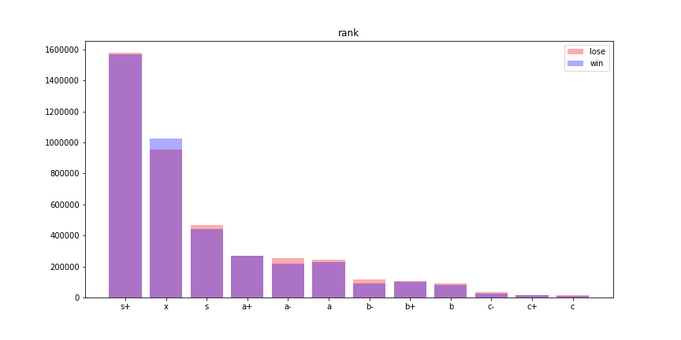
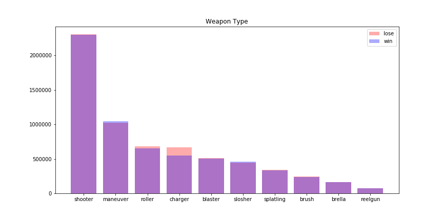
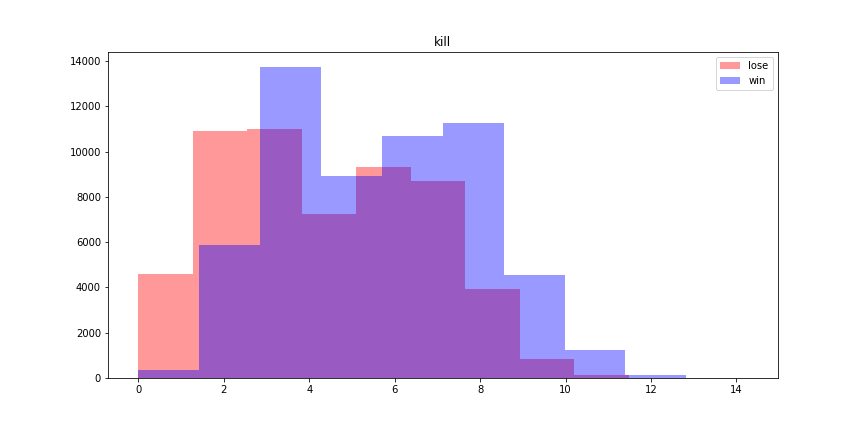
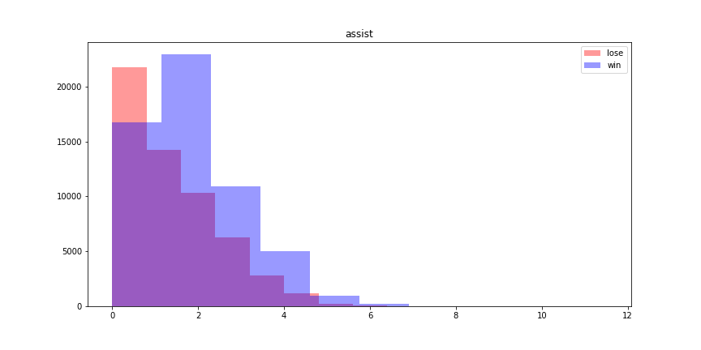
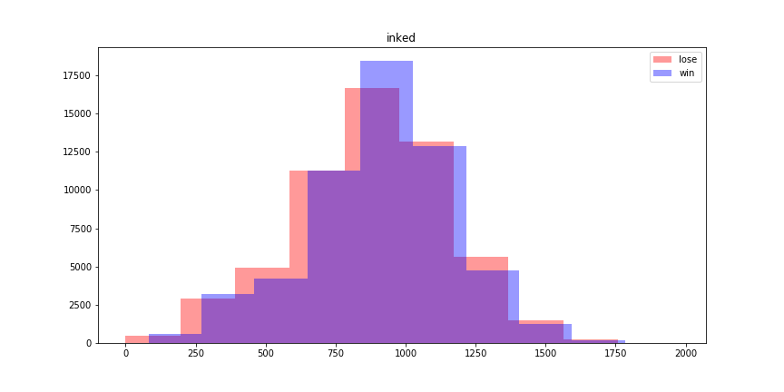
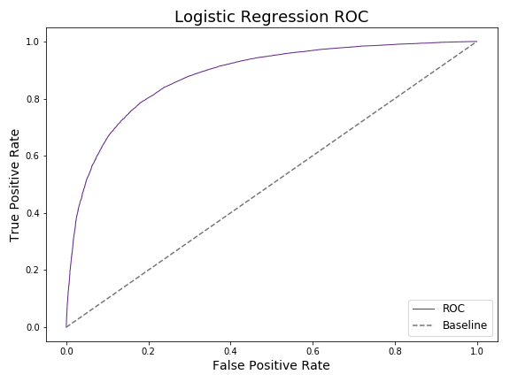
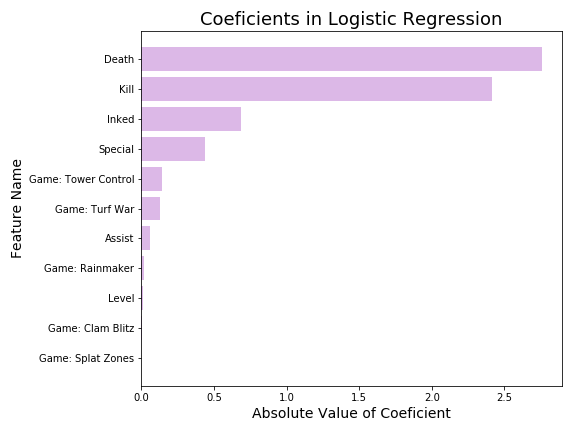
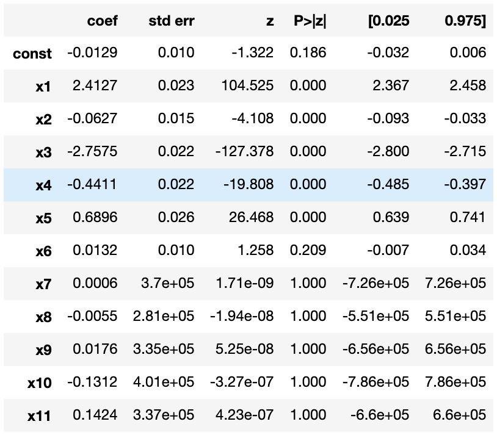
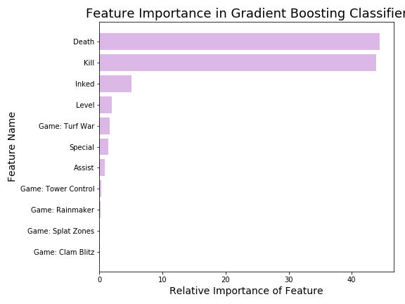

# REMOVE THIS
1. high-level description of the project, including motivation, goals, etc.
2. EDA:  data source + visualizations + feature engineering
3. description of your model and results (possible tables & visualization)
4. summary / interpretations
5. [optional] future work

‌‌&nbsp;&nbsp;&#9650; &#9650;&nbsp;&#9650; You found the secret Triforce!

# Splatoon-2-Meta-Modeling

#### Acknowledgments
This project would not have been possible without the data from [fetus-hina](https://github.com/fetus-hina)'s website [stat.ink](https://stat.ink/).

## Description
#### Motivation and Goals
&nbsp;&nbsp;&nbsp;&nbsp;&nbsp;&nbsp;This project started as an attempt to predict win rate based on various factors that can be determined pre-match such as game mode, weapon choice, and rank. I wanted to do this less for the end result of the prediction, but so I could better understand what contributes most to a win in Splatoon 2 and how it varied across different game modes.

&nbsp;&nbsp;&nbsp;&nbsp;&nbsp;&nbsp;However, I quickly found that contrary what some might believe, Splatoon 2 is a perfectly balanced game with no exploits. Without hyperbole, there were practically no differences in win rate across all the factors I considered. Due to that, I was unable to get any useful models, but my process is documented in [Processing and Cleaning](https://github.com/Rokushou/Splatoon-2-Meta-Modeling/blob/master/Processing%20and%20Cleaning.ipynb) and [Modeling](https://github.com/Rokushou/Splatoon-2-Meta-Modeling/blob/master/Modeling.ipynb) if anyone else would like to attempt this.

&nbsp;&nbsp;&nbsp;&nbsp;&nbsp;&nbsp;Pivoting from my dead end, I decided to do predictions on aggregated post-match statistics. While predicting the outcome of a match with information obtained after the match is next to useless, modeling it allows me to use inferential statistics to determine the most important factors for winning as well as being able to score and compare players using their post-match statistics. Useful for answering the age old question of "How hard did I (or in most cases my friend Jeff) carry the team?"

#### Overview a.k.a. tl;dr
-Player data gathered from stat.ink, a site where players can voluntarily upload their match data. It is located in `data/raw` and schema can be found in [schema.md](https://github.com/Rokushou/Splatoon-2-Meta-Modeling/blob/master/schema.md).

-Predict win rate by modeling binary win/loss and using predict percent.

-Used logistic regression and gradient boosting to determine most important factors contributing to winning, and a neural network to perform predictions with 81% accuracy.

-As a future project, create a simple interface like a flask website to output predictions based on user inputted data.

## EDA (Experimental Data Analysis)
My first dead end model came about because of improper EDA. I thought I had enough domain knowledge, so used intuition to decide which features to use. Turns out that the distributions between win and loss were nearly identical for all my features. I did find a few things worth noting though.

Rank X has significantly more wins than losses. This is not surprising as they are the top players but it is interesting that S+ did not exhibit this.

* Note: `maneuver` is the dualie category and `reelgun` is the nozzlenose family.

Confirming the belief that charger (sniper) players are dead weight, the charger weapon category has the highest proportion of losses of all weapon types, with rollers coming in a distant second.

#### Actual Proper EDA
I was initially planning on modeling with features such like the ones shown above, which showed little if any difference in distribution between win and lose. Eventually I decided that this would never produce any meaningful predictions and decided to resort to post-match results. these are some of the more interesting overlapped histograms.

Kills have two peaks in the distribution for both win and lose. This may be because there are objective focused players and kill focused players.

Assists are very low compared to kills due to the fast paced nature (fights usually end before a teammate can notice and contribute). The peaks are very distinct between win and lose.

Turf inked has a lot of overlap and the shape of the distribution is almost identical for win and lose. Is inking the cause of the win or does the winning team have more opportunity to ink?

## Modeling

#### Logistic Regression
I decided to throw `mode, kill, assist, death, special, inked, level` into a simple logistic model with L1 penalty for a quick initial estimate. It did surprisingly well with 80.2% accuracy and could be kept for inferential regression.

#### Gradient Boosting
After optimizing a gradient boosting classifier with a gridsearch, I only managed a slight accuracy increase to 80.4%. This model may still be useful since I can draw inferences from feature importance.

#### Neural Network
I spent a lot of time manually tuning hyperparameters and managed to get 80.5% accuracy. This means that my initial logistic regression was plenty good even though I just threw it together. I would use s neural net if I wanted a purely predictive model but will still stick to the logistic regression as I can better draw inferences with it.

### Drawing Inferences

#### Effect Size with Inferential Regression

The Linear Regression Assumptions:
- Linearity
    - My logistic regression model does almost well as Gradient Boosting and Neural Net. This would not be true if the data was not linear.
- Linear Independence
    - Predictors chosen in a way that do not overlap, Kill-Assist was not chosen for this reason.
- Independence
    - Given a large enough sample of matches and 8 players per match, observations should be independent even if they were uploaded by a small subset of players.
- Homoscedasticity
    - Data has similar distributions across both classes.
- Normal Distribution of Errors
    - There should be minimal error due to data being directly exported from the game API.

With these conditions satisfied, I can properly use inferential regression. First I get the coefficients of the logistic regression.

It seems like death and kill are the most important by a large margin, no surprise there. However it does appear that death (not dying) is more important than getting kills. Inked and special are also good and it is interesting that inked is more important than special because one of the main motivations for inking is to build special meter.

* x1 - x11 correspond to `Kill, Assist, Death, Special, Inked, Level, Game: Splat Zones, Game: Clam Blitz, Game: Rainmaker, Game: Turf War, Game: Tower Control`

The p-values show that Kill, Assist, Death, Special, and Inked are all good predictors while the game modes are particularly poor predictors.

#### Feature importance with Gradient Boosting

My gradient boosting model was a little more accurate than my logistic regression, and while it is not as easy to understand as coefficients, I can still make inferences using feature importance.

Deaths and kills are also the most important here, however they are more evenly weighted. Inked has dropped in proportional importance but is still 3rd and handily beats special. Surprisingly, level is now a relatively useful predictor, indicating that it may have a nonlinear correlation to win rate.
